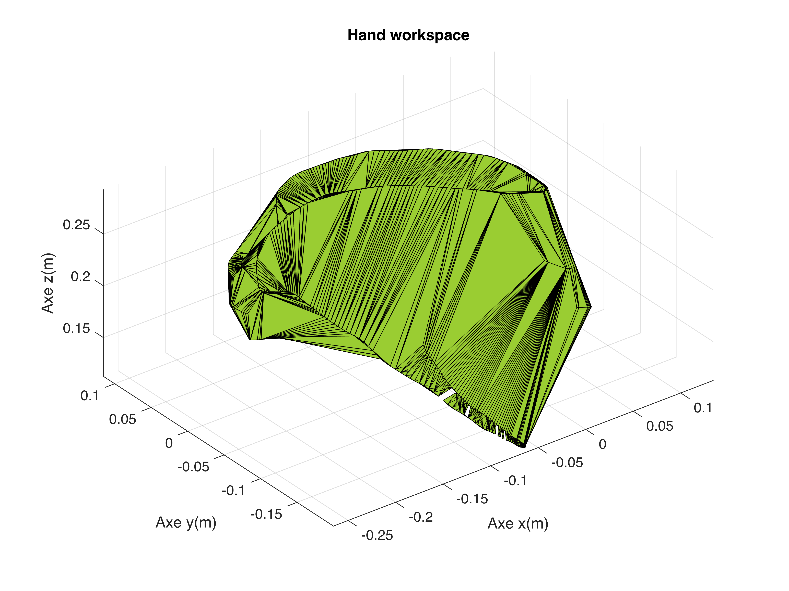
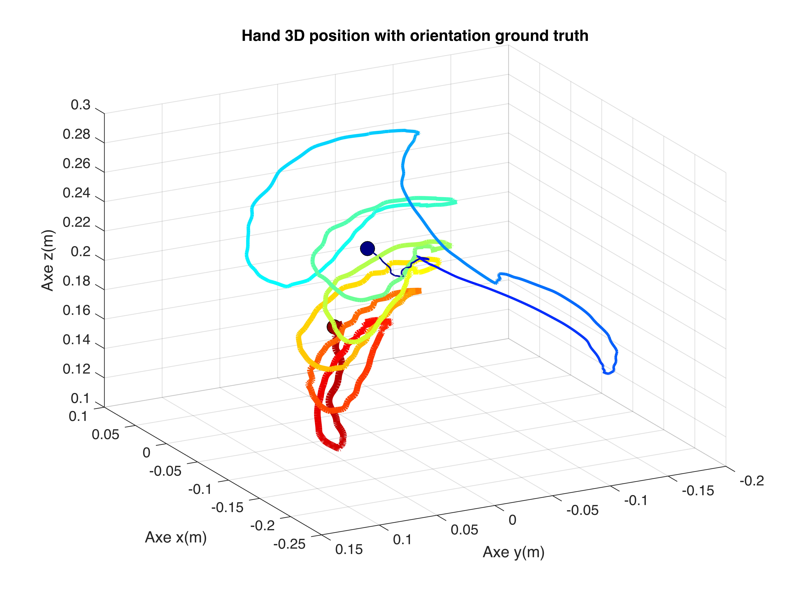

# Readme

Dans ce live script je détaille l'exploitation de tous les scripts conçus dans le cadre de mon stage.

## Chargement des données d'IMU

Les données d'IMUs collectées avec l'application sensor logger sont enregistrées en csv, et sont chargées dans l'environnement de travail avec la fonction `readData`, elle prend en argument le chemin d'accès du dossier contenant les fichiers .csv et retourne l'accélération en $m/s^2$ (Nx3), la vitesse angulaire en $rad/s$ (Nx3), l'intensité du champ magnétique en microTesla (Nx3), l'orientation en quaternion et suivant les angles d'euler (yaw, roll et pitch) en rad/s (Nx3).

```matlab
[acc, gyro, magne, quat, yrp] = readData('circle_slow');

nom_acc = 'accéléromètre';
nom_gyro = 'gyroscope';
nom_magne = 'magnétomètre';
nom_quat = 'quaternion';
nom_yrp = 'yrp angles';

donnees = {acc(1:10,:), gyro(1:10,:), magne(1:10,:), quat(1:10,:), yrp(1:10,:)};
noms = {nom_acc, nom_gyro, nom_magne, nom_quat, nom_yrp};

for i = 1:numel(donnees)
    disp(['Données de ', noms{i}, ':']);
    disp(donnees{i});
end
%% Output
Données de accélometre:
         0         0         0
         0         0         0
   -0.0221   -0.1928   -0.0080
   -0.0111   -0.1588    0.0174
   -0.0963   -0.1393   -0.0492
   -0.1287   -0.0970   -0.1170
   -0.1173   -0.0367   -0.1861
   -0.1017   -0.0564   -0.1494
   -0.1508   -0.1298   -0.0381
   -0.1076   -0.1711    0.0290
Données de gyroscope:
   -0.1808   -0.2627   -0.0168
   -0.1830   -0.2808   -0.0232
   -0.1915   -0.2787   -0.0274
   -0.2181   -0.2563   -0.0338
   -0.2490   -0.2382   -0.0391
   -0.2671   -0.2446   -0.0338
   -0.2831   -0.2659   -0.0306
   -0.3033   -0.3000   -0.0296
   -0.3246   -0.3415   -0.0264
   -0.3395   -0.3884   -0.0168
Données de magnétometre:
   -6.8250   -1.4438  -34.9688
   -7.2938   -1.7438  -35.2688
   -7.0875   -1.7063  -35.0250
   -7.0313   -1.8188  -34.9313
   -7.1250   -1.8750  -34.7438
   -6.9750   -1.7625  -34.8375
   -7.1438   -1.6500  -34.6875
   -7.2750   -1.6500  -34.6500
   -7.3688   -1.6688  -34.5375
   -7.3125   -1.5375  -34.4062
Données de quaternion:
      0.98978 + 0.074258i - 0.091856j - 0.079857k
      0.98896 + 0.073363i - 0.092573j - 0.089467k
      0.98754 + 0.059993i -  0.09325j -  0.11164k
      0.98648 + 0.053312i - 0.094088j -  0.12313k
      0.98404 + 0.047823i - 0.094283j -  0.14314k
      0.98193 + 0.043961i - 0.094474j -  0.15799k
      0.98029 +   0.0413i - 0.095195j -   0.1681k
      0.97879 + 0.038388i - 0.096198j -  0.17674k
       0.9763 + 0.034285i - 0.097036j -  0.19038k
      0.97411 + 0.030082i - 0.098139j -  0.20143k
Données de yrp angles:
    0.1469   -0.1731   -0.1624
    0.1663   -0.1731   -0.1624
    0.2130   -0.1733   -0.1398
    0.2371   -0.1748   -0.1287
    0.2783   -0.1740   -0.1214
    0.3089   -0.1737   -0.1164
    0.3297   -0.1748   -0.1132
    0.3476   -0.1767   -0.1094
    0.3759   -0.1783   -0.1041
    0.3989   -0.1809   -0.0983
```

## Implementation du filtre de Kalman et estimation de l'orientation

L'implémentation du filtre de Kalman se fait en utilisant la fonction `ahrsfilter` de la Sensor `Fusion and Tracking Toolbox`, disponible depuis la version 2018b de Matlab.
https://fr.mathworks.com/videos/add-on-explorer-106745.html

```matlab
% Fréquence d'acquisition des données d'IMU en Hz
Fs = 100; 
% Definition du filtre
fuse = ahrsfilter('SampleRate',Fs)
%% Output
fuse = 
  ahrsfilter with properties:

                        SampleRate: 100               Hz      
                  DecimationFactor: 1                         
                AccelerometerNoise: 0.00019247        (m/s²)² 
                    GyroscopeNoise: 9.1385e-05        (rad/s)²
                 MagnetometerNoise: 0.1               (µT)²   
               GyroscopeDriftNoise: 3.0462e-13        (rad/s)²
           LinearAccelerationNoise: 0.0096236         (m/s²)² 
          MagneticDisturbanceNoise: 0.5               (µT)²   
     LinearAccelerationDecayFactor: 0.5                       
    MagneticDisturbanceDecayFactor: 0.5                       
     ExpectedMagneticFieldStrength: 50                µT      
               InitialProcessNoise: [12⨯12 double]            
                 OrientationFormat: 'quaternion'              

% Estimation de l'orientation en quaternion 
quat_est = fuse(acc,gyro,magne);
% OU l'on peut aussi estimer la vitesse angulaire par le filtre
%[quat_est, gyro_est] = fuse(acc,gyro,magne)

```
## Calcul de l'erreur d'estimation rms1

L'erreur d'estimation de l'orientation est évaluée comme la **root mean square error** de la distance en quaternion entre la valeur estimée et la vérité terrain, elle est implémentée dans la fonction `loss2qad`.
```matlab
rms1 = loss2qad(quat, quat_est)

%% Output
rms1 = 79.5513
```
## Optimisation du filtre 
Le filtre crée precedent possède des paramètres qui influent sur la qualité de l'estimation, alors il est necessaire d'avoir les bonnes valeurs ou faire une bonne optimisation de ces derniers, à cet effet Matlab prose une fonction pour le faire `tune`, qui se sert de l'orientation en vérité de terrain pour optimiser les paramètres du filtres.
La fonction `tuneKF` prend en paramètre les données d'accéleration, de vitesse angulaire, d'intensité du champs magnetique, la vérite terrain de l'orientation en quaternion et le filtre a optimisé et retourne les paramètres optimisé du filtre dans une structure matlab.
```matlab
filterParams = tuneKF(acc,gyro,magne,quat,fuse)

%% Output
filterParams = 
    Value: [4.4946e-04 1.5766e-06 13.4355 2.0968e-16 1.2930 26.7894 1.0000 1.0000]
     Name: 'AccelerometerNoiseGyroscopeNoiseMagnetometerNoiseGyroscopeDriftNoiseLinearAccelerationNoiseMagneticDisturbanceNoiseLinearAccelerationDecayFactorMagneticDisturbanceDecayFactor'

% Estimation de l'orientation avec le filtre optimisé 
quat_estOpt = fuse(acc,gyro,magne);
```
## Calcul de la nouvelle erreur d'estimation rms2
```matlab
rms2 = loss2qad(quat, quat_estOpt)

%% Output
rms2 = 24.6485
```
**Comparaison de rms1 et rms2**

rms1 = 79.553  < rms2 = 24.6485, le filtre optimisé est plus performant.

## Estimation de la trajectoire tridimensionnelle 
L'estimation de la trajectoire tridimensionnelle se fait avec la fonction `handPosition, qui prend en paramètre *l'orientation* suivant les angles d'euler yaw (axe z), roll (axe y), pitch (axe x) en rad/s, *la longueur du bras*, et *la distance du centre de pression (COP)* à l'épaule et renvoie la position en x, y et z.
```matlab
% Conversion de l'orientation suivant les angles d'euler
yrp_est = euler(quat_estOpt,'ZYX', 'frame');

% Définition des longueurs de bras et distance COP-épaule
armLength = 0.224;
cop2shoulder = 0.0448;
% Calcul de la trajectoire
pos3D = handPosition(yrp_est, armLength, cop2shoulder);
size(pos3D)

%% Output
ans = 1×2    
           3        1902
```
## Estimation de la surface et le volume de travail et tracé de la trajectoire 3D
L'estimation de la surface et du volume de travail se fait avec la fonction `plotPos3D` et trace aussi la trajectoire 3D en niveau de couleur (peut être mis en %commentaire si non necessaire)
```matlab
[surf, vol] = plotPos3D(pos3D)
```

```matlab
%% Output
surf = 0.1815
vol = 0.0043
```
## Evaluation des descripteurs de finesse : Travel path, jerk, surface et volume de travail

La fonction `assesment` prend en paramètre la position 3D (3xN), les accélérations (Nx3), les vitesses angulaires (Nx3) et la longueur du bras et renvoie la **surface**, **le volume de travail**, **la vitesse**, la **norme de l'accélération**, le **jerk** et le **travel path**.

```matlab
[surface,volume,velocity,acceleration,Jerk,TP] = assesment(pos3D,acc,gyro,armLength)
```


```matlab
%% Output
- Surface = 0.1815
- Volume = 0.0043
- Velocity:
  - [0.0715, 0.0753, 0.0760, ..., 0.0612]
- Acceleration:
  - [0, 0, 0.1943, ..., 0.1684]
- Jerk:
  - [0, 0.1943, -0.0341, ..., -0.0494]
- Travel Path = 4.4739


```
## Evaluation de la géneralisation du filtre de kalman
Diverses trajectoires ont été generées (08) afin d'évaluer la géneralisation du filtre de kalman.


**Protocole mis en oeuvre:** une trajectoire de référence est sélectionnée, puis un filtre est ajusté pour optimiser son comportement sur cette trajectoire. Ensuite, ce filtre optimisé est évalué en utilisant les autres trajectoires. Pour ces trajectoires supplémentaires, nous itérons le processus d’optimisation en ajus-tant un nouveau filtre, et nous évaluons les descripteurs de ces trajectoires en les comparant à la trajectoire de référence précédemment établie.
Le script validation implémente ce protocole et stocke le résultats dans la structure Validation, i.e. les erreurs loss1 entre les descripteurs évaluée sur la trajectoire de réference et ceux évalués sur les autres trajectoires
```matlab
% Exécution du script
% validation
% Validation est la structure qui stocke erreurs dans des tableaux 
% circle_slow2circle_fast est l'erreur des descripteurs avec comme
% trajectoire de réference circle_slow et la trajectoire courante
% circle_fast
```
